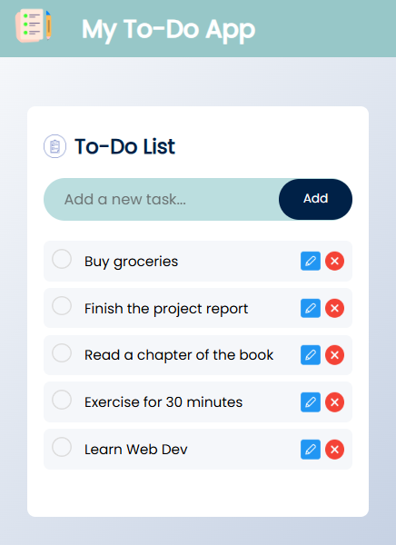
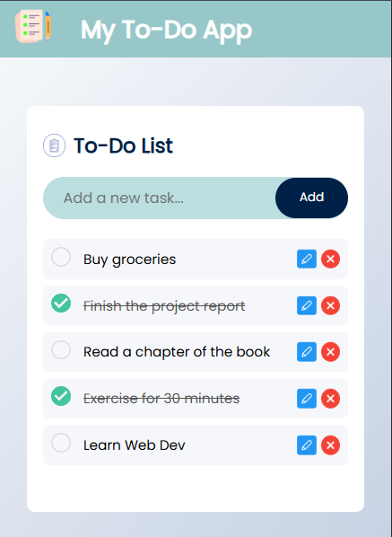
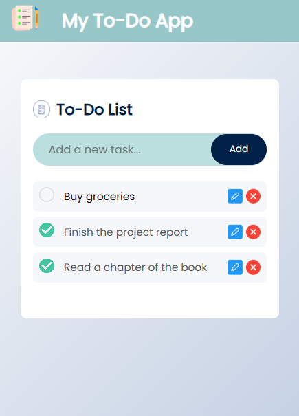

# MY TO-DO APP ✅  





*A Modern, Responsive To-Do App with Local Storage*

## Live Demo
```
https://thisisnotasad.github.io/Todo-App/
```

## 🌟 Features  
- **Add tasks** quickly with clean input  
- **Edit tasks** inline with a single click  
- **Delete tasks** with intuitive icons  
- **Mark tasks complete** with visual feedback  
- **Persistent storage** using localStorage  
- **Fully responsive** - works on mobile & desktop  
- **Clean UI** with smooth animations  

## 📱 Responsive Design  
- Mobile-first approach  
- Adapts to all screen sizes (320px to 4K)  
- Touch-friendly buttons and controls  
- Optimized text sizing with CSS `clamp()`  

## 🛠️ Tech Stack  
- **Frontend**: HTML5, CSS3, JavaScript  
- **Styling**: Flexbox & CSS Grid  
- **Persistence**: Browser localStorage API  

## 🚀 Quick Start  
1. Clone the repo:  
   ```bash
   git clone https://github.com/thisisnotasad/Todo-App.git 
   ```
2. Open index.html in your browser